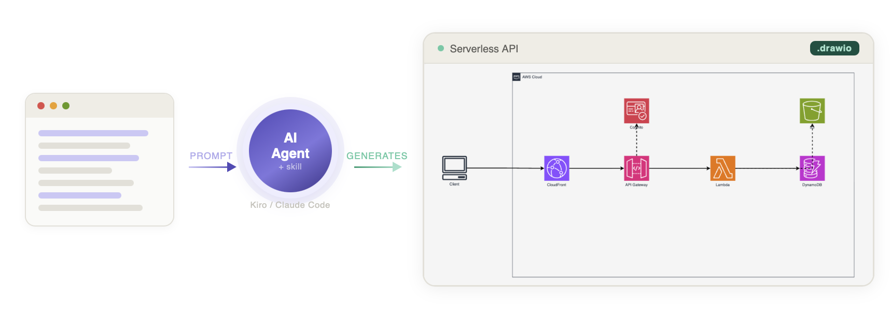
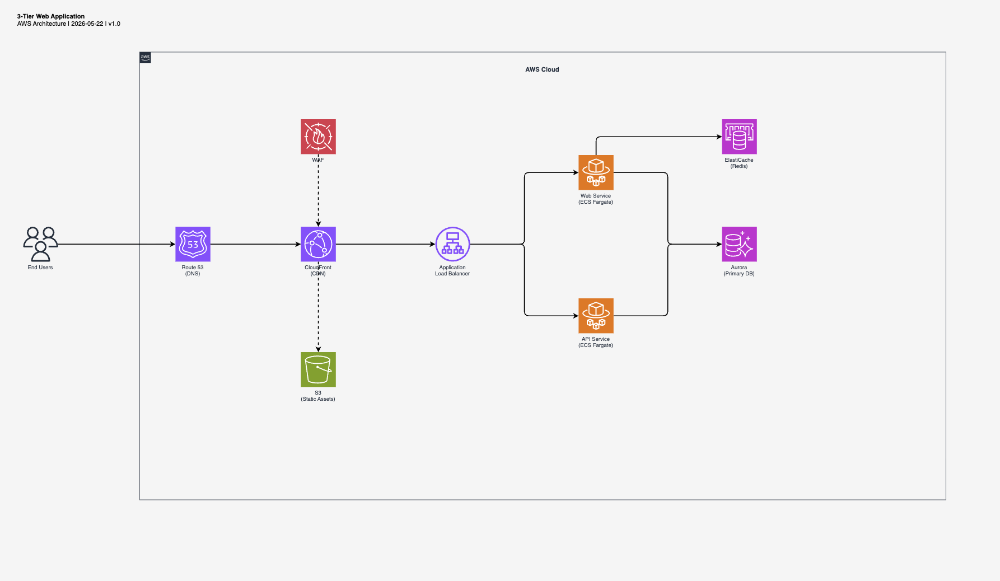
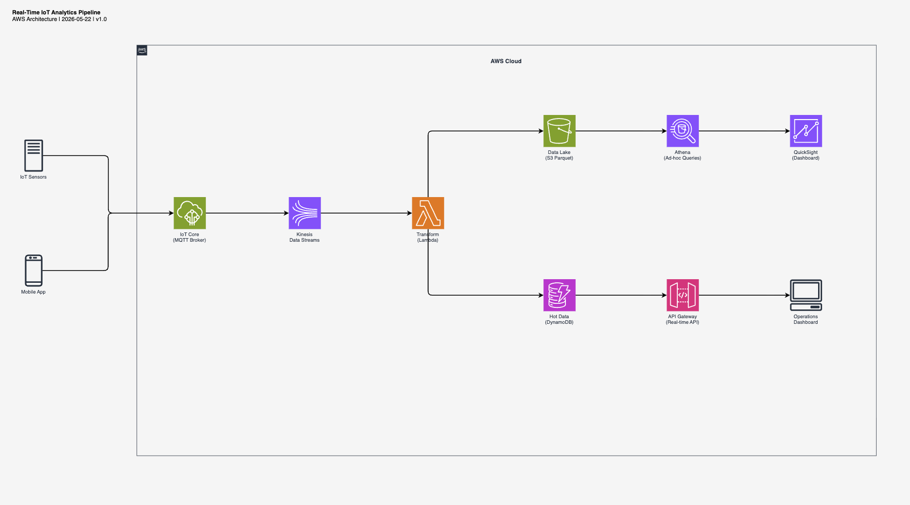
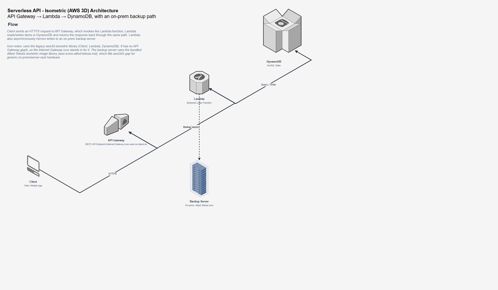
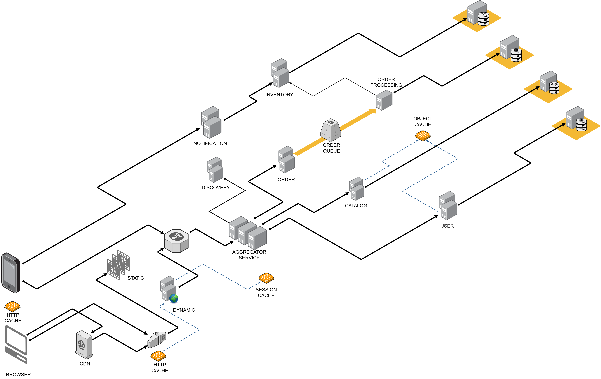

# AWS Architecture Diagram Skill

<div align="center">

[](https://vidanov.github.io/aws-architecture-diagram-skill/)


</div>



<div align="center">

[Quick start](#quick-start) · [Examples](#example-output) · [Why icons break](#why-icons-break-and-how-this-skill-prevents-it) · [Comparison](#comparison) · [Contributing](#contributing)

</div>

One prompt. One `.drawio` file. Every icon renders correctly because the skill carries a verified catalog of 270+ stencil names, not guesses.

<div align="center">
  
</div>

Works with any AI assistant: ChatGPT, Claude Projects, Kiro CLI, Claude Code, Cursor, or internal agents.

## The problem this solves

AI agents generate broken AWS diagrams. Icons show as empty boxes because the stencil names are wrong. Layout is random. Styling is inconsistent. You spend more time fixing the output than you saved generating it.

This skill gives the agent the correct stencil names, layout rules, and styling conventions. The output opens clean in draw.io with no manual fixes.

## Quick start

```bash
npx skills add vidanov/aws-architecture-diagram-skill
```

Install to a specific agent:

```bash
npx skills add vidanov/aws-architecture-diagram-skill --agent claude-code
npx skills add vidanov/aws-architecture-diagram-skill --agent cursor
npx skills add vidanov/aws-architecture-diagram-skill --agent kiro-cli
```

Install globally (available in all projects):

```bash
npx skills add vidanov/aws-architecture-diagram-skill --global
```

[](https://skills.sh/vidanov/aws-architecture-diagram-skill)

<details>
<summary><b>ChatGPT, Claude Projects, or any AI with custom instructions</b></summary>

No CLI required:

1. Copy the prompt from [`chatgpt/PROMPT.md`](chatgpt/PROMPT.md) into your system prompt or custom instructions
2. Upload the reference files from [`chatgpt/references/`](chatgpt/references/) to the knowledge base
3. Start asking for diagrams

> Tip: Set temperature to 0.3 for consistent XML output.

</details>

<details>
<summary><b>Manual install (Claude Code / Kiro CLI)</b></summary>

```bash
# Claude Code
mkdir -p ~/.claude/skills/aws-architecture-diagram
cp claude/SKILL.md ~/.claude/skills/aws-architecture-diagram/SKILL.md
cp -r references ~/.claude/skills/aws-architecture-diagram/references

# Kiro CLI (global)
mkdir -p ~/.kiro/skills/aws-architecture-diagram
cp kiro/SKILL.md ~/.kiro/skills/aws-architecture-diagram/SKILL.md
cp -r references ~/.kiro/skills/aws-architecture-diagram/references
```

</details>

## Usage

Ask for a diagram:

```
Create an AWS architecture diagram for a serverless API with Lambda, DynamoDB, and API Gateway
```

With export:

```
Create an AWS architecture diagram as PNG for a real-time data pipeline with Kinesis, Lambda, and S3
```

## Example output

### Event-driven order processing
> "Create an event-driven order processing architecture with SQS, Lambda, DynamoDB, and EventBridge"


[Download .drawio](examples/example-event-driven.drawio)

### Real-time IoT analytics
> "Create a real-time IoT analytics pipeline with Kinesis, Lambda, S3 data lake, and DynamoDB"


[Download .drawio](examples/example-streaming.drawio)

### 3-tier web application
> "Create a 3-tier web application with CloudFront, ALB, ECS Fargate, Aurora, and ElastiCache"


[Download .drawio](examples/example-3tier.drawio)

### 3D serverless API (isometric)
> "Create a 3D AWS architecture diagram for a serverless API with Lambda, DynamoDB, and S3"


[Download .drawio](examples/example-3d-serverless-api.drawio)

### 3D e-commerce website architecture (isometric)
> "Create a 3D isometric AWS architecture for an e-commerce website"


[Download .drawio](examples/example-3d-ecommerce-website-architecture.drawio)

## Why icons break (and how this skill prevents it)

draw.io AWS icons have two patterns with opposite `strokeColor` rules:

| Pattern | Style | strokeColor | Use for |
|---------|-------|-------------|---------|
| Service-level | `shape=mxgraph.aws4.resourceIcon;resIcon=mxgraph.aws4.<name>` | `#ffffff` (required) | Main service icons (colored square + white glyph) |
| Resource-level | `shape=mxgraph.aws4.<name>` | `none` (required) | Sub-resources (silhouette icons) |

Confusing these two patterns is the #1 cause of broken icons in AI-generated diagrams. The skill encodes the correct pattern for every icon.

draw.io stencil names also don't match current AWS service names. Renamed services keep old identifiers (OpenSearch is still `elasticsearch_service` in the stencil). The skill carries the correct mapping so the agent never guesses.

## What the skill enforces

- Left-to-right flow (UI on left, data on right)
- 78px icons, strokeWidth=2 edges, AWS color palette
- Minimum 220px horizontal spacing, 250px vertical between lanes
- Two-step approach: generate XML, export to PNG, visually verify, fix if needed
- Only verified stencil names (no empty-box surprises)

## Supported services (270+ icons)

| Category | Examples |
|----------|----------|
| Compute | Lambda, EC2, ECS, EKS, Fargate |
| App Integration | API Gateway, SNS, SQS, EventBridge, Step Functions |
| Database | DynamoDB, RDS, Aurora, ElastiCache |
| Storage | S3, EFS, EBS |
| Networking | CloudFront, Route 53, VPC, ELB (ALB/NLB) |
| Security | IAM, Cognito, KMS, WAF |
| Analytics/ML | Kinesis, Athena, Bedrock, SageMaker |

## Known broken stencils (avoid these)

- `mxgraph.aws4.dynamodb_table` → use `mxgraph.aws4.dynamodb` instead
- `mxgraph.aws4.dynamodb_stream` → use `mxgraph.aws4.dynamodb` with label
- `mxgraph.aws4.general_saml_token` → use `mxgraph.aws4.traditional_server`

## Comparison

| Solution | Output | Editable | Zero deps | Verified icons |
|----------|--------|----------|-----------|----------------|
| **This skill** | `.drawio` | yes | yes (markdown file) | yes (270+) |
| [jgraph/drawio-mcp](https://github.com/jgraph/drawio-mcp) | `.drawio` | yes | no (MCP server) | no |
| [awslabs/aws-diagram-mcp-server](https://pypi.org/project/awslabs.aws-diagram-mcp-server/) | PNG | no | no (Python+GraphViz) | N/A |
| [awslabs/diagram-as-code](https://github.com/awslabs/diagram-as-code) | PNG/SVG | no | no (Go binary) | N/A |
| [clouda.ai](https://clouda.ai/) | PNG | no | N/A (SaaS) | N/A |

No runtime dependencies. A markdown file, not a server. Output is native `.drawio` XML you can open, edit, and version-control.

## Structure

```
aws-architecture-diagram-skill/
├── chatgpt/
│   ├── PROMPT.md                       # Universal prompt (any AI assistant)
│   └── references/                     # Icon catalog in .txt format
├── kiro/SKILL.md                       # Kiro CLI version
├── claude/SKILL.md                     # Claude Code version
├── references/                         # Icon catalog in .md format (9 files)
├── examples/                           # Example .drawio outputs
├── templates/                          # Base templates
└── docs/                               # Hero image, example PNGs
```

## Contributing

PRs welcome:

- Found a broken stencil name? Fix it.
- Want to add a new AWS service icon? Add it to the correct references file.
- Layout improvement ideas? Open an issue or PR.
- Bug with a specific AI agent? Report it.

## Contributors

- [@svetozarm](https://github.com/svetozarm) (Svetozar Miucin) — 3D isometric diagram support
- [@SyedSamrozeAli](https://github.com/SyedSamrozeAli) (Syed Samroze Ali) — 3D isometric diagram support

## License

MIT

---

If this saved you a diagramming session, a star ⭐ helps the next person find it.

## Also by the author

- [writing-craft-skill](https://github.com/vidanov/writing-craft-skill): teach AI agents to write well using classic copywriting craft plus AI anti-pattern detection
- [shape](https://github.com/vidanov/shape): runtime governance for AI agents (phases, transactions, budget gates, proof traces)
